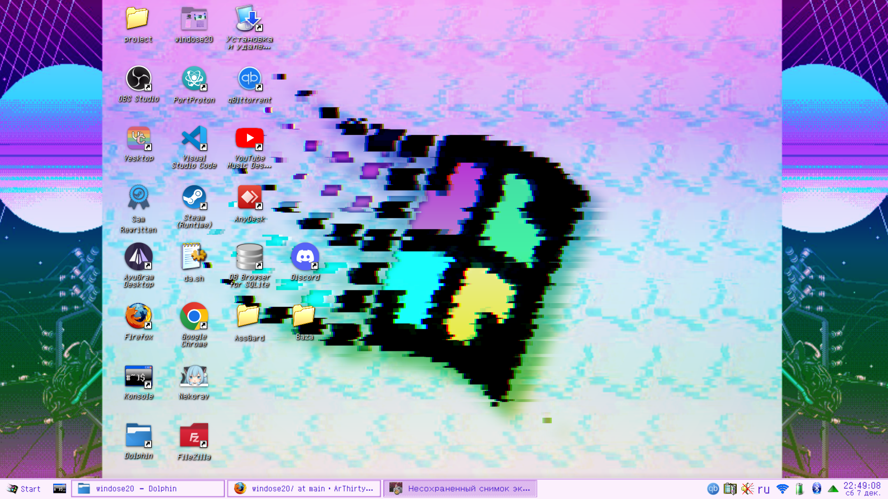

# Needy Girl Overdose Linux rice resources
---
## This configuration is shown on _KDE Plasma_ 


### The final result will be as follows:



# 1.Font

>First, download [this font](https://github.com/Ar4ikTrirtyFour/windose20/blob/main/fonts/zpix.ttf), and then set it as the system font in the settings, then reboot.


# 2. Taskbar

> For the panel, take Reactionary [Link](https://store.kde.org/p/2138468), install via ocs-url (Searcn in Google how to install it for your distribution, I will show you using **Arch Linux** as an example), install it from [AUR](https://aur.archlinux.org/packages/ocs-url) And then apply it

# 3.Cursors, windows, etc.

> It’s even easier here because one topic doesn’t work out differently and we download it via ocs-url

__Color palette: [Here](https://www.pling.com/p/1700393/)__

__Cursor: [Here](https://www.pling.com/p/1700441/)__

__Windows: [Here](https://www.pling.com/p/1700394/)__

__Wallpaper: [Here](https://github.com/Ar4ikTrirtyFour/windose20/blob/main/pngs/bg.png)__

__Icons: [Here](https://store.kde.org/p/1483944)__

_And then we insert all these parameters in the KDE settings_

# 4.Launch Button 

> Open the settings of the "Application launch menu" widget
> Change to [This icon](https://github.com/Ar4ikTrirtyFour/windose20/blob/main/pngs/logo.png), write text "Start" 
> that's all.

# 5.Neofetch

>I will attach the config file below, you change .config/neofetch/user.conf to [this file](https://github.com/Ar4ikTrirtyFour/windose20/blob/main/configs/config.conf)
> There are also configs for [Cava](https://github.com/Ar4ikTrirtyFour/windose20/blob/main/configs/config) and [Fastfetch](https://github.com/Ar4ikTrirtyFour/windose20/blob/main/configs/config.jsonc)

# 6.Terminal

> Apply the background [From this file](https://github.com/Ar4ikTrirtyFour/windose20/blob/main/pngs/JINEBG.png) in Tile format, change the white color to "#6a00ff" and change the font in the terminal to [this](https://github.com/Ar4ikTrirtyFour/windose20/blob/main/fonts/PixelMplus10-Regular.ttf)

# 7. Os-Realses
>Save the file with [Logo](https://github.com/Ar4ikTrirtyFour/windose20/blob/main/pngs/logo_with_name.png) to a location convenient for you.

>Open /etc/os-release and change THESE SETTINGS:
```
NAME="Windose20"
PRETTY_NAME="Windose20"
HOME_URL="https://angelkawaii.com/"
DOCUMENTATION_URL="https://angelkawaii.com/"
LOGO="path/to/your/file/logo"
```
### However, after the update it may crash and have to be rewritten

