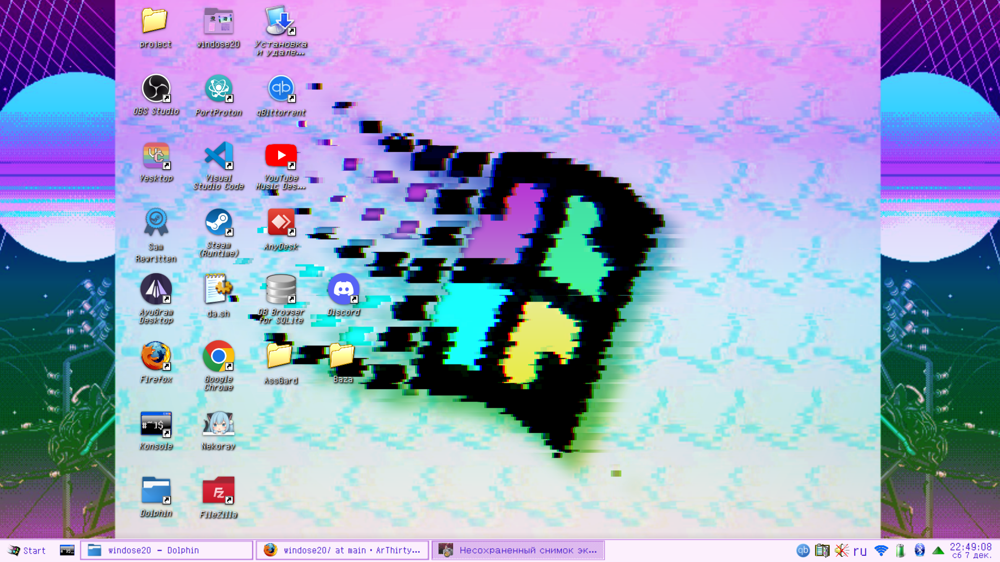

# Needy Girl Overdose Linux rice resources
# In Engilsh : Soon..
---
## Данная конфиругация показывается на _KDE Plasma_ 


### Результат по итогу будет таков:


* # 1.Шрифт

>Для начала скаичваем [Zpix](https://github.com/ArThirtyFour/windose20/blob/main/fonts/zpix.ttf) , а потом ставим его системным шрифтом , затем перезагружемся и теперь он у нас везде стоит.

* # 2. Панель задач

> Для панели берем Reactionary [Ссылка](https://store.kde.org/p/2138468) , установим через ocs-url (Прогугливаете как его поставить для вашего дистрибутива , я покажу на примере **Arch Linux**) , ставьте его из [AUR](https://aur.archlinux.org/packages/ocs-url) И после применяем его

* # 3.Курсоры , окна и т.д

> Тут еще проще т.к одной темой не получается приедтся по другому и скачиваем через ocs-url

__Цветовая палитра: [Здесь](https://www.pling.com/p/1700393/)__

__Курсор: [Здесь](https://www.pling.com/p/1700441/)__

__Окна: [Здесь](https://www.pling.com/p/1700394/)__

__Обои: [Здесь](https://github.com/ArThirtyFour/windose20/blob/main/pngs/bg.png)__

__Иконки: [Здесь](https://store.kde.org/p/1483944)__

_И после вставляем все эти параметры в настройках KDE_

* # 4.Пуск 

> Открываем настройки виджета "Меню запуска приложения"
> Меняем на  ["Эту иконку](https://github.com/ArThirtyFour/windose20/blob/main/pngs/logo.png) , м пишем "Start" 
> на этом все.


* # 5.Neofetch

>Внизу я приложу файл с конфигом , вы поменяйте в .config/neofetch/user.conf на [данный файл](https://github.com/ArThirtyFour/windose20/blob/main/config.conf)

* # 6.Терминал

> Применяем фон [Из этого файла](https://github.com/ArThirtyFour/windose20/blob/main/pngs/JINEBG.png) в формате Черепицы , меняем цвет белого на "#6a00ff" и меняем шрифт в терминале на [этот](файл)

* # 7. Os-Realses
>сохраняем файл с [Логотипом](https://github.com/ArThirtyFour/windose20/blob/main/pngs/logo_with_name.png) в удобное вам место.

>Открываем /etc/os-release и меняем ЭТИ ПАРАМЕТРЫ:
```
NAME="Windose20"
PRETTY_NAME="Windose20"
HOME_URL="https://angelkawaii.com/"
DOCUMENTATION_URL="https://angelkawaii.com/"
LOGO="путь/до/вашего/файла/слоготипом"
```


